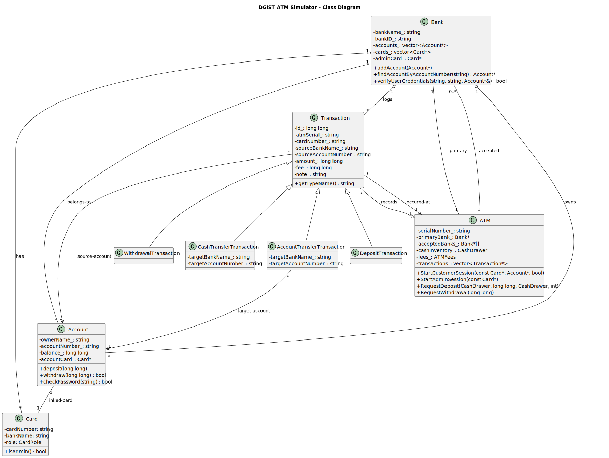

# Docs

This folder contains internal documentation for the DGIST ATM Simulator project.

- `project-uml.puml`: PlantUML source file describing the class diagram of the project.

Rendered diagrams
- `project-uml.svg`: Rendered SVG (committed to repo)
- `project-uml.png`: Rendered PNG (committed to repo)

Preview in Markdown (in this README):



How to generate the diagram:

1) Using PlantUML (requires Java):

```powershell
# If you have plantuml installed as a CLI:
plantuml -tsvg docs/project-uml.puml  # generates SVG
plantuml -tpng docs/project-uml.puml  # generates PNG

# Or with the JAR directly:
java -jar plantuml.jar -tsvg docs/project-uml.puml
java -jar plantuml.jar -tpng docs/project-uml.puml
```

2) Using VS Code extensions: install "PlantUML" and open `docs/project-uml.puml` to preview/export.

Notes:
- This file is intentionally created under `docs/` so it's not excluded by `.gitignore`.
- Feel free to modify the UML if you want additional method names, signatures, or relationships included.

Adding a Visual Studio Class Diagram (.cd)
----------------------------------------

If you'd prefer to use Visual Studio's Class Designer, follow these steps:

1) Make sure the Class Designer component is installed in Visual Studio (Tools -> Get Tools and Features -> Modify -> Individual components -> Class Designer).
2) Open your solution/project in Visual Studio.
3) In Solution Explorer, right-click the project you want the diagram associated with → Add → New Item...
4) In the Add New Item dialog, expand Installed -> Visual C# or General (or simply search for "Class Diagram") → choose **Class Diagram (.cd)** under the Utility category → name it (e.g., `ATMModel.cd`) → Add.
5) The file will be added to your project. Double-click it to open Class Designer where you can drag classes, interfaces, and other types into the diagram.

Notes on the placeholder file
- The repo contains a minimal placeholder file: `docs/ATMModel.cd`. This is a basic skeleton that Visual Studio can open — it's only a starting point. Use Visual Studio Class Designer to build/modify the diagram and save it so it becomes fully usable in the IDE.

Visual Studio CLI (Optional)
If you prefer to script this operation using the Visual Studio Installer's `setup.exe`, you can modify the Visual Studio installation to include the Class Designer component. (See the docs for `setup.exe` parameters.)
