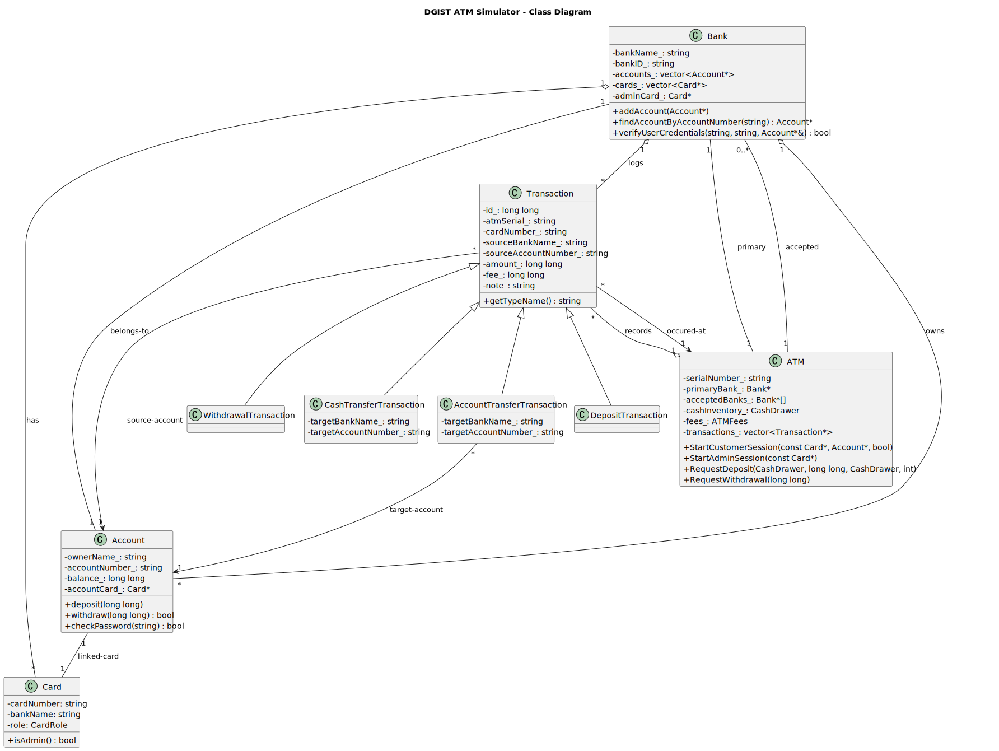

# Docs

This folder contains internal documentation for the DGIST ATM Simulator project.

- `project-uml.puml`: PlantUML source file describing the class diagram of the project.

Rendered diagrams
- `project-uml.svg`: Rendered SVG (committed to repo)
- `project-uml.png`: Rendered PNG (committed to repo)

Preview in Markdown (in this README):



How to generate the diagram:

1) Using PlantUML (requires Java):

```powershell
# If you have plantuml installed as a CLI:
plantuml -tsvg docs/project-uml.puml  # generates SVG
plantuml -tpng docs/project-uml.puml  # generates PNG

# Or with the JAR directly:
java -jar plantuml.jar -tsvg docs/project-uml.puml
java -jar plantuml.jar -tpng docs/project-uml.puml
```

2) Using VS Code extensions: install "PlantUML" and open `docs/project-uml.puml` to preview/export.

Notes:
- This file is intentionally created under `docs/` so it's not excluded by `.gitignore`.
- Feel free to modify the UML if you want additional method names, signatures, or relationships included.

Adding a Visual Studio Class Diagram (.cd)
----------------------------------------

If you'd prefer to use Visual Studio's Class Designer, follow these steps:

1) Make sure the Class Designer component is installed in Visual Studio (Tools -> Get Tools and Features -> Modify -> Individual components -> Class Designer).
2) Open your solution/project in Visual Studio.
3) In Solution Explorer, right-click the project you want the diagram associated with → Add → New Item...
4) In the Add New Item dialog, expand Installed -> Visual C# or General (or simply search for "Class Diagram") → choose **Class Diagram (.cd)** under the Utility category → name it (e.g., `ATMModel.cd`) → Add.
5) The file will be added to your project. Double-click it to open Class Designer where you can drag classes, interfaces, and other types into the diagram.

Notes on the placeholder file
- The repo contains a minimal placeholder file: `docs/ATMModel.cd`. This is a basic skeleton that Visual Studio can open — it's only a starting point. Use Visual Studio Class Designer to build/modify the diagram and save it so it becomes fully usable in the IDE.

Visual Studio CLI (Optional)
If you prefer to script this operation using the Visual Studio Installer's `setup.exe`, you can modify the Visual Studio installation to include the Class Designer component. (See the docs for `setup.exe` parameters.)

Opening diagram links in VS Code (browser & security notes)
-------------------------------------------------------

The rendered `docs/project-uml.svg` contains clickable `vscode://file/` links that open the associated source file in Visual Studio Code. Here are steps and troubleshooting tips to open those links safely and reliably:

- Ensure Visual Studio Code is installed on your machine; the `vscode://` protocol is registered by VS Code during installation.
- Open `docs/project-uml.svg` in a browser (e.g., Chrome, Edge) or open it inside VS Code. Clicking any class box will attempt to open the linked file in VS Code.
- Browser prompts & trust:
	- Most browsers prompt when an external application is invoked with a custom protocol. When prompted, choose **Open** or **Allow** to confirm.
	- If the browser asks whether to remember your choice, it's safe to check it only if you trust the project and local files.
- Verify the link manually: open the Windows Run dialog (Win+R) and paste a `vscode://file/...` link, for example:

```powershell
vscode://file/C:/dgist/termproject6/Bank.hpp
```

If the link opens VS Code and the target file, then clicking links from the browser should also work.
- Troubleshooting if a click does not open VS Code:
	- Make sure the path points to a file that exists on your local machine.
	- Make sure your browser allows opening external apps (the browser’s UI shows a prompt to allow launching the external app).
	- On Windows: Settings → Apps → Default apps → choose default apps by protocol and verify that `vscode` links are associated with Visual Studio Code.
	- If the system shows an error “No application is registered for the scheme ‘vscode’”, reinstall Visual Studio Code or run the installer to repair it.
- Security note: treat any `vscode://` links in external SVGs with care. Only click them from sources and repositories you trust because they can open and execute code locally via your editor environment.

Tip: If you prefer not to use the `vscode://` protocol, open `docs/project-uml.svg` in VS Code, or open `project-uml.puml` and use the PlantUML preview plugin to navigate the diagram.
